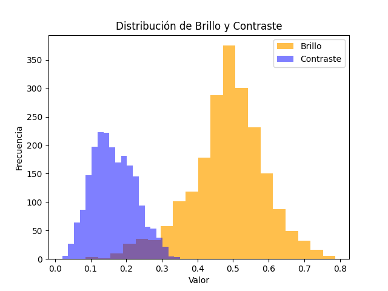
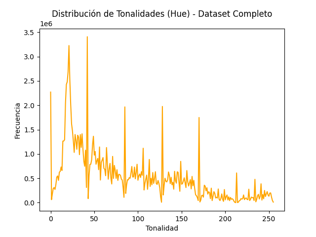

# Reporte de Datos

Este documento contiene los resultados del análisis exploratorio de datos.

## Resumen general de los datos

En esta sección se presenta un resumen general de los datos. Se describe el número total de observaciones, variables, el tipo de variables, la presencia de valores faltantes y la distribución de las variables.

El UC Merced Land Use Dataset contiene 2.100 imágenes distribuidas uniformmemnte en 21 categorías (100 imágenes por categoria).

* El formato de las imágenes es TIF (Tagged Image File Format) el cual es un formato de archivo gráfico que se utiliza para almacenar imágenes de alta calidad y se emplea comunmente en sectores como la impresión y cartográfía.

* El tamaño del dataset es de 418.75 MB

* Resolución de las imágenes 256 X 256

* Tamaño promedio de la imágen 205 KB

* Espacio de color: RGB

* Canal Alpha : No

## Resumen de calidad de los datos

### 1. Valores Faltantes 

No se encontraron valores faltantes ya que todas las imágenes estan presentes en cada una d sus carpetas.

### 2. Valores extremos y duplicados 

El análisis de valores extremos no es aplicable en este contexto debido a que todas las imagenes tienen cararristicas generales similares como por ejemplo resolución y formato.

Se empleo en scripts/find_duplicates para el caso de los Valores duplicados se encontro solo una imagen duplicada airplane02.tif y se eliminó en el preporcesamiento.

### 3. Errores

Se utilizó el scripts/clean_and_validation para detectar posibles imagenes corruptas. Concluyendo que no se detectarón imaágenes corruptas.

#### 4. Acciones ejecutadas

* Fue aplicada una conversión de imágenes de formatos .Tiff a JPEG para mejor compatibilidad con modelos de aprendizaje profundo , especialmente se realizó este proceso para grantizar la compatibilidad con TensorFlow y Keras.

* Las imágenes fueron normalizadas mediante un reescalado de los valores de los píxeles den un rango de 0 a 1 mediante scripts/normalize.py empleando ImageDataGenerator de keras.preporcessing debido a su mejor compatibilidad y rendimiento en relación con la red neuronal convolucional de EfficientNetB0

## Variable objetivo

Variable objetivo a estimar : La variable objetivo a estimar es la categoría a la que pertenece cada imagen.Las categorías corresponden a diferentes tipos de uso del suelo: las cuales incluyen 0. forest (bosque) 1. buildings (edificios) 2. river (río) 3. mobilehomepark (parque de casas móviles) 4. harbor (puerto) 5. golfcourse (campo de golf)  6. agricultural (agrícola) 7. runway (pista de aterrizaje) 8. baseballdiamond (campo de béisbol) 9. overpass (paso elevado) 10. chaparral (matorral) 11. tenniscourt (cancha de tenis) 12. intersection (intersección) 13. airplane (avión) 14. parkinglot (estacionamiento) 15. sparseresidential (residencial disperso) 16. mediumresidential (residencial medio) 17. denseresidential (residencial denso) 18. beach (playa) 19. freeway (autopista) 20. storagetanks (tanques de almacenamiento)

## Variables individuales

Las variables explicativas en este caso corresponden a los valores de los píxeles en las imágenes. Cada imagen es representada como una matriz de tamaño (256x256x3) para capturar información de los canales RGB.

Vectorización: Los valores de los píxeles se normalizan al rango [0, 1] y se convierten en un vector plano de 224x224x3 = 150528 características por imagen despues de aplicado el redimensinamiento de las mismas (tamaño original 256x256x3). Esto sirve como entrada para el modelo.

## Ranking de variables

El enfoque inicial no incluye técnicas de reducción de dimensionalidad como PCA, ya que se utilizará la representación completa de las imágenes para aprovechar al máximo las capacidades del modelo preentrenado EfficientNetB0.

Posteriormente, se evaluará la importancia de las características extraídas por el modelo para identificar patrones relevantes. Esto se realizará utilizando herramientas como:

* Visualización de mapas de calor de activaciones de capas intermedias o saliency maps para entender qué partes de las imágenes contribuyen más a las predicciones.
* Importancia de características derivada del modelo final, evaluando el peso de las representaciones internas.
* Dependiendo de los resultados iniciales, se considerará el uso de técnicas adicionales como PCA o embeddings más compactos si se observan problemas de rendimiento o necesidad de optimización.}
* Visualización de características aprendidas:

Analizar las representaciones intermedias aprendidas por las capas del modelo para identificar patrones relevantes que estén asociados con la variable objetivo. Esto podría incluir el uso de:

- Mapas de calor (Grad-CAM) para entender qué regiones de las imágenes contribuyen más a la predicción.
- Proyecciones de características en espacios de menor dimensión, como t-SNE o UMAP, para visualizar la agrupación de categorías.

* Errores de clasificación:
Examinar imágenes mal clasificadas para detectar patrones que puedan revelar confusiones comunes entre clases.

* Relación semántica:

Explorar cómo ciertas clases comparten características visuales comunes (por ejemplo, "residencial denso" y "residencial medio") para entender cómo el modelo interpreta estas relaciones.

Estas acciones permitirán evaluar la relación entre las características visuales representadas en las imágenes y la categoría de uso del suelo que se busca predecir, ofreciendo una interpretación más relevante en el contexto del aprendizaje profundo.

## Caracteristicas del conjunto de datos

### Distribución de Contraste y Brillo

### Análisis de la Distribución de Brillo y Contraste en un Conjunto de Imágenes

Lo primero que se puede notar es que la **distribución bimodal del brillo** sugiere que hay dos grupos o poblaciones distintas de imágenes en el conjunto de datos. Esto podría deberse a que:
- Las imágenes provienen de diferentes sensores.
- Corresponden a diferentes tipos de superficies terrestres (por ejemplo, una mezcla de imágenes de áreas urbanas y áreas rurales).

Por otro lado, la **distribución unimodal y simétrica del contraste** indica que la mayoría de las imágenes tienen niveles de contraste similares. Esto es una característica deseable para procesar o analizar las imágenes de manera conjunta. Sin embargo:
- Los rangos de contraste más pequeños, para esta distribución homogénea podría ser una limitación.

---

#### Implicaciones y Posibles Usos

##### 1. **Segmentación o Clasificación de las Imágenes**
La bimodalidad del brillo sugiere que se podrían identificar dos o más grupos o clases principales dentro del conjunto de datos. Esto podría ser útil para:
- Tareas de segmentación automática.
- Clasificación de imágenes basada en sus características.

##### 2. **Ajuste de Parámetros de Procesamiento**
Si se sabe que hay diferencias en las características de brillo y contraste entre subgrupos de imágenes, se podría considerar:
- Ajustar los parámetros de procesamiento de manera independiente para cada grupo.

##### 3. **Detección de Outliers**
Los valores en los extremos de las distribuciones podrían indicar:
- Imágenes con características inusuales debido a errores de adquisición o problemas en los sensores.
- La presencia de fenómenos particulares en esas imágenes.

---

Este análisis permite comprender mejor la naturaleza del conjunto de datos y planificar estrategias más informadas para su procesamiento o ampliación.

### Distribución de Tonalidades

### Análisis de la Distribución de Tonalidades

# Análisis de la Distribución de Tonalidades (Hue) en el Conjunto de Imágenes

## Observaciones Principales

Al analizar la gráfica de la distribución de tonalidades (Hue) para el conjunto completo de 2100 imágenes, se pueden hacer las siguientes observaciones:

1. **Forma Multimodal**:
   - La distribución tiene varios picos o máximos a lo largo del rango de tonalidades entre 0 y 250.
   - Esto indica que no hay una distribución uniforme de tonalidades, sino que ciertos valores están más representados que otros.

2. **Picos Pronunciados**:
   - Los picos más destacados se encuentran alrededor de los valores **20**, **50**, **120**, **160** y **230** de tonalidad.
   - Esto sugiere la existencia de grupos o clases de imágenes con tonalidades predominantes en esos rangos.

3. **Valles o Mínimos**:
   - La distribución presenta varios valles, lo que implica que algunas tonalidades están subrepresentadas en el conjunto de datos.
   - Esto podría deberse a la menor ocurrencia de ciertos tipos de superficies o materiales en las imágenes.

4. **Forma Irregular y No Simétrica**:
   - La distribución no es homogénea, mostrando una preferencia o sesgo hacia ciertos rangos de tonalidad.

---

## Implicaciones y Posibles Usos

### 1. **Segmentación y Clasificación**
   - La multimodalidad de la distribución sugiere que las imágenes podrían agruparse en diferentes clases o categorías en función de sus tonalidades predominantes.

### 2. **Detección de Anomalías**
   - Las tonalidades en los valles de la distribución podrían indicar imágenes atípicas o con características inusuales.

---

Este análisis de la distribución de tonalidades proporciona una base sólida para mejorar el procesamiento, segmentación y análisis de las imágenes en el conjunto de datos.
Mis cambios

Dado que en este proyecto las variables explicativas corresponden a los píxeles y patrones visuales de las imágenes, no es posible realizar un análisis directo de correlación o regresión lineal entre estas y la variable objetivo (categoría de uso del suelo). En su lugar, se planea llevar a cabo las siguientes acciones una vez entrenado el modelo:

